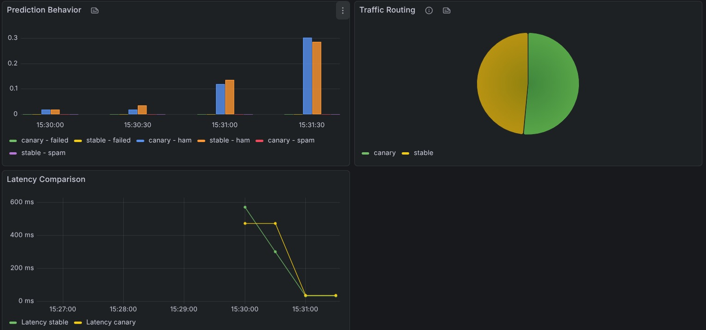
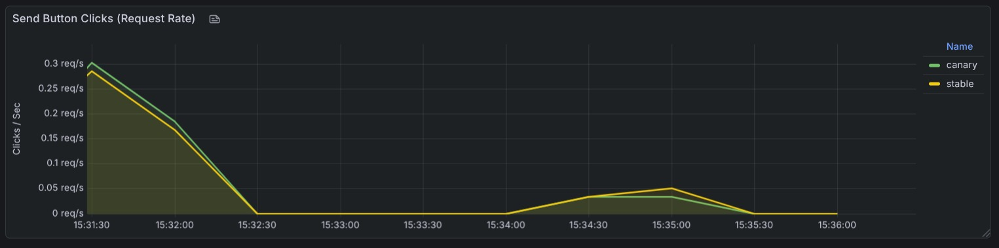

# Continuous Experimentation

## Experiment Overview
Testing whether adding a yellow button to the UI (canary version) increases user engagement (button clicks) without negatively impacting latency or prediction behavior.

## Changes Implemented
- **Stable Version (0.0.9)**: Standard UI without yellow button
- **Canary Version (0.0.8)**: Adds yellow button to the interface
- **Traffic Split**: 90% stable / 10% canary

## Hypothesis
The canary version with the yellow button will increase button click rates compared to the stable version, while maintaining comparable latency and consistent prediction behavior.

**Falsifiable**: If canary version shows latency increase > 10% OR different prediction distribution (ham/spam/failed ratios) OR does NOT show increased button clicks, the hypothesis is rejected.

## Relevant Metrics
1. **Button Clicks**: button_clicked metric, comparing click frequency between stable and canary
2. **Latency**: Response time comparison between stable and canary
3. **Prediction Behavior**: Frequency distribution of outcomes (ham, spam, failed) for each version
4. **Traffic Routing**: Verification that 90/10 split is enfored

## Experiment Setup
- **Duration**: 1 hours
- **Access**: `http://team16-sms.local`
- **Monitoring**: Prometheus (1s scrape) + Grafana dashboard

## Decision Process

### Decision Criteria:
| Metric | Success Criteria |
|--------|------------------|
| Button Clicks | Canary shows ≥ 10% more clicks than stable (adjusted for traffic split) |
| Latency | Canary latency within 10% of stable latency |
| Prediction Distribution | Ham/Spam/Failed ratios consistent between versions |
| Traffic Split | Actual split within 85-95% / 5-15% range |

### Decision:
- **Accept**: Button clicks increase AND latency/prediction metrics meet criteria
- **Reject**: Button clicks don't increase OR any other metric fails

### Rollback (Manual):
No automatic rollback. Manual process:
1. Update `values.yaml` → change `canaryWeight: 0`
2. Run `helm upgrade sms-app ./helm-chart/sms-app`
3. All traffic immediately routes to stable

## Screenshots & Data

*Figure 1: Grafana dashboard showing experiment metrics over time.*

*Figure 2: Comparison of button click rates between stable and canary versions.*