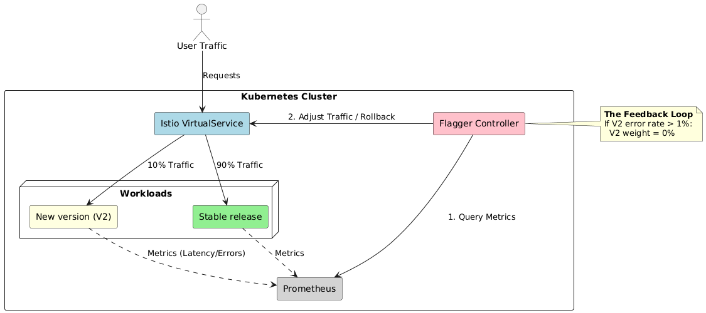

# Extension Proposal: Automated Rollback Strategy

## 1. Release Engineering Shortcoming
**Issue:**
Our current project uses Istio for traffic splitting (90/10) to introduce new versions. However, there is no automated mechanism to handle failures. If the new version (receiving 10% of traffic) has errors, it continues to run until someone manually detects the issue and reverts the configuration.

**Effect:**
This lack of automation leads to prolonged user impact during bad releases. The recovery time depends entirely on human reaction speed, which can range from 5 minutes to multiple hours, and on the need to constantly monitor the system, a significant shortcoming in our Release Engineering process.

## 2. Proposed Extension
**Solution:**
Implement **Automated Rollback** using the **Flagger** Kubernetes operator.

This extension connects to our **Deployment and Experimentation** assignments. Instead of manually applying `VirtualService` weights, we will configure Flagger to:
1.  Monitor the Prometheus metrics we established.
2.  Automatically revert traffic to the stable version if the error rate exceeds a safety threshold.

This changes our deployment from a manual process to a managed workflow.

**Visualization**

## 3. Implementation Plan
To implement this, we will:
1.  **Install Flagger:** Deploy the Flagger operator in the `istio-system` namespace.
2.  **Connect Metrics:** Configure Flagger to query our existing Prometheus service (`http://prometheus.monitoring:9090`).
3.  **Define Rollout Resource:** Replace our static `k8s/istio.yml` configuration with a Flagger resource that defines the rollback thresholds (e.g., `500ms` max latency).

## 4. Experimentation Plan
To objectively measure the improvement of our proposed extension, we will implement the following experiment:

* **Baseline (Manual):** The experiment starts with deploying a faulty version (returning HTTP 500s) and measures the duration from the "Alert Firing" timestamp in Prometheus to the timestamp when the manual `kubectl apply` for the stable configuration is executed.
* **Experiment (Automated):** We will deploy the same faulty version using the Flagger setup. We will measure the duration from the first threshold breach in Prometheus to the moment Flagger automatically updates the Istio `VirtualService` to cut traffic.
* **Success Metric:** We will compare the Mean Time of both approaches. The extension is considered a success if the automated rollback occurs consistently within 60 seconds or less, significantly reducing the window of user impact compared to human reaction time.

## 5. Assumptions and Downsides

**Assumptions:**
* We assume that our current metrics are sufficient to detect all types of faulty releases.
* We assume that the set interval will be fast enough to resolve issues before users are significantly impacted.

**Downsides:**
* If Prometheus goes down in our new environment, deployments cannot be released. Adding a new point of failure to our release pipeline.
* The same can be said for adding Flagger, which will add a new component to maintain.

## 6. References
* **AWS Builders' Library:** *Automating safe, hands-off deployments* - Describes strategies for removing manual intervention from deployments using automated safety checks and rollbacks. [https://aws.amazon.com/builders-library/automating-safe-hands-off-deployments/](https://aws.amazon.com/builders-library/automating-safe-hands-off-deployments/)
* **Flagger Documentation:** *Automated Rollbacks* - Technical details on how the rollback mechanism works with Istio. [https://docs.flagger.app/usage/rollback](https://docs.flagger.app/usage/rollback)